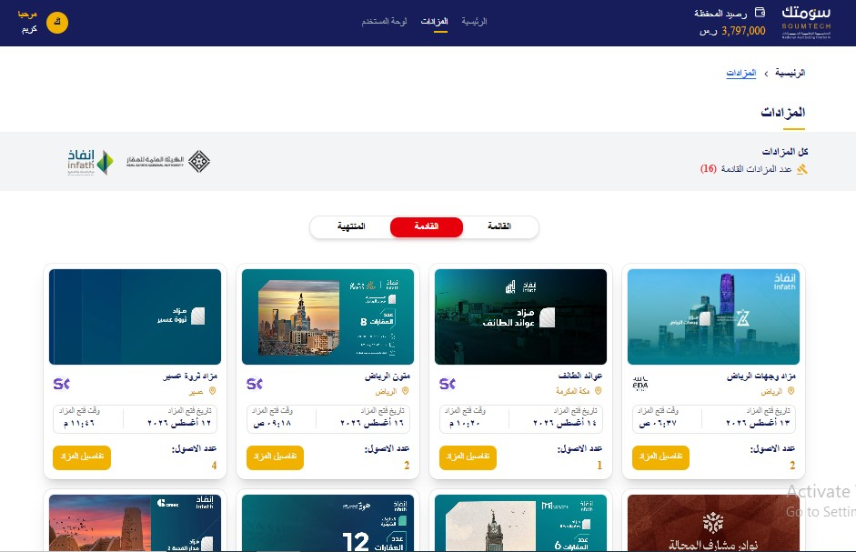
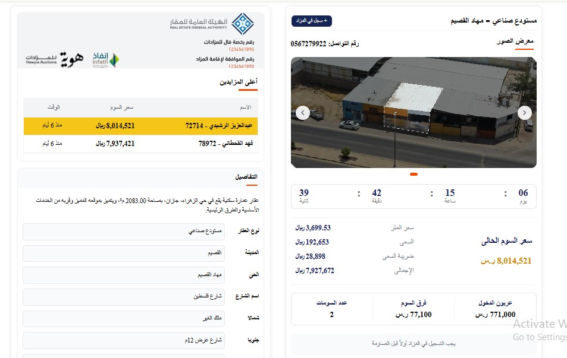
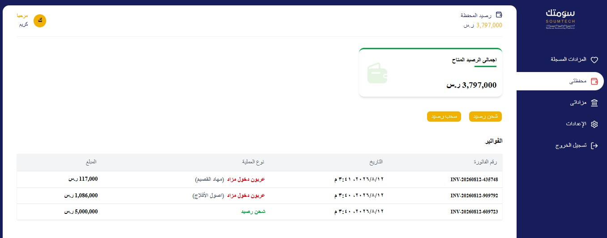
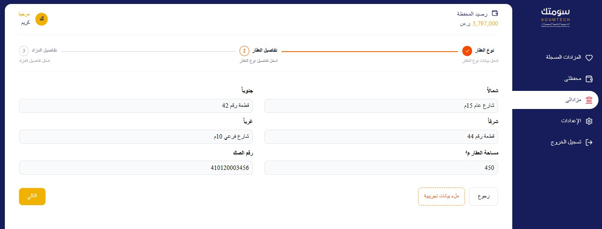

# Soumtech — Real Estate Auction Platform

A full-stack real estate auction platform inspired by [soum.tech](https://soum.tech/), built to manage property auctions, auction assets, bidding, wallets, companies, and role-based administration.

> Personal/portfolio project — built end-to-end solo to demonstrate modern Next.js architecture and full-stack development practices.

**🔗 Live Demo:** [soumtech.vercel.app](https://soumtech.vercel.app/)

---

## 📸 Screenshots

### Auctions


### Auction Bids


### User Dashboard/ my Wallet


### Forms

---

## ✨ Key Features

* **Live cyclic auction countdowns** — synchronized through a database-driven PostgreSQL view without client-side polling or WebSockets.
* **Multi-company auction management** — companies can manage auctions containing multiple real-estate assets with bidding history and auction participation.
* **Wallet & bidding system** — wallet balances, auction registrations, and bid-related transactions are managed through secure Supabase RPC functions and an auditable transaction ledger.
* **Multi-step asset registration wizard** — a 3-step `AddAssetWizard` for property details, pricing, and location with Zod validation and React Hook Form.
* **Interactive property map** — `react-leaflet` integration with custom SVG markers, selected-property navigation, and SSR-safe dynamic imports.
* **Admin dashboards** — management views for companies, users, and employees with reusable table components and client-side search.
* **Role-based authentication** — Supabase Auth with profile synchronization, server-verified sessions, and admin-only routes.
* **Responsive dashboard shell** — responsive sidebar navigation built with Base UI's `Sheet`.

---

## 🛠 Tech Stack

| Layer              | Technologies                                               |
| ------------------ | ---------------------------------------------------------- |
| Framework          | Next.js (App Router)                                       |
| Language           | TypeScript                                                 |
| Styling            | Tailwind CSS, shadcn/ui, Base UI                           |
| Database           | Supabase (PostgreSQL), RLS, triggers, views, RPC functions |
| Backend Logic      | Supabase Edge Functions                                    |
| Forms & Validation | React Hook Form, Zod                                       |
| Maps               | react-leaflet                                              |
| Async UI           | `useTransition` / `startTransition`                        |
| Deployment         | Vercel                                                     |

---

## 🏗 Architecture Highlights

### Server-first data flow

Data fetching is handled primarily through Server Components, while mutations are performed through Server Actions. Client Components are reserved for interactive functionality such as forms, dialogs, filters, and map widgets.

Client-side data fetching is avoided unless the feature genuinely requires client-side interactivity or state.

### Feature-based structure

Domain logic is organized under `features/`, keeping auction, asset, company, authentication, and other business concerns self-contained instead of scattering domain logic across generic folders.

### Reusable table architecture

A generic `ReusableTable` component is shared across the application's management dashboards.

Domain-specific cell rendering is handled through reusable functions such as:

* `renderCompanyCell`
* `renderUserCell`
* `renderBidderCell`

This keeps table structure consistent while allowing each domain to customize its displayed data without duplicating table markup.

### Database-driven live auction state

Auction countdowns are calculated using a PostgreSQL view based on cycle timestamps and modulo arithmetic.

This allows every client to derive the same remaining auction time without requiring client-side polling or persistent WebSocket connections.

### Security-conscious data access

Row-Level Security is enabled across user-facing tables.

For admin functionality that requires access to sensitive data, such as user emails from `auth.users`, the application uses a restricted PostgreSQL view accessed through a server-only Supabase client.

The `service_role` key is never exposed to the browser.

---

## 📂 Project Structure

```text
├── api/                  # Server-only data-fetching functions by domain
├── app/                  # Next.js App Router routes
├── components/           # Shared UI components and reusable primitives
├── features/             # Feature-based domain modules
│   ├── auctions/
│   ├── assets/
│   ├── companies/
│   └── ...
├── lib/
│   └── supabase/         # Client, server, and admin Supabase clients
├── schema/               # Zod validation schemas
├── public/
│   └── assets/           # Static assets
└── supabase/
    └── migrations/       # Database migrations and configuration
```

---

## 🗄 Database Schema

The main database entities include:

* `companies` — companies responsible for hosting auctions
* `auctions` — auction listings with cycle-based live status
* `assets` — individual real-estate properties within an auction
* `bidders` — users participating in auctions and placing bids
* `display_bidders` — seeded/display bidding data
* `profiles` — application user profiles linked to `auth.users`
* `wallet_transactions` — auditable wallet transaction ledger
* `registrations` — auction participation records
* `invoices` — auction-related billing records

All user-facing tables use **Row-Level Security (RLS)**.

Sensitive admin data is exposed through restricted database views rather than weakening RLS policies on the underlying tables.

---

## 🔐 Security

Security-sensitive operations are handled on the server wherever possible.

Key practices include:

* Supabase Row-Level Security across user-facing tables
* Server-side session verification
* Admin-only route protection
* Server-only Supabase clients for privileged operations
* Restricted PostgreSQL views for sensitive admin data
* `service_role` credentials kept exclusively on the server
* No privileged database credentials exposed to client-side code

> **Important:** `SUPABASE_SERVICE_ROLE_KEY` must never be exposed to the browser or committed to the repository.

---

## 🚀 Getting Started

### Prerequisites

* Node.js
* npm
* A Supabase project

### 1. Clone the repository

```bash
git clone https://github.com/karimsayed7/soumtech.git
cd soumtech
```

### 2. Install dependencies

```bash
npm install
```

### 3. Configure environment variables

Create a `.env.local` file:

```env
NEXT_PUBLIC_SUPABASE_URL=your-supabase-url
NEXT_PUBLIC_SUPABASE_ANON_KEY=your-anon-key
SUPABASE_SERVICE_ROLE_KEY=your-service-role-key
```

The `SUPABASE_SERVICE_ROLE_KEY` is **server-only** and must never be exposed to client-side code.

### 4. Run the development server

```bash
npm run dev
```

Open http://localhost:3000 in your browser.

---

## 📌 Known Limitations

The current version focuses on demonstrating the application's architecture and core functionality. The following areas could be expanded for a larger production deployment:

* [ ] Automated unit and end-to-end testing with Playwright
* [ ] CI/CD pipeline with GitHub Actions
* [ ] Error monitoring and observability
* [ ] Pagination for large admin datasets
* [ ] Additional performance optimization for high-volume auction data

---

## 📄 License

This project is for portfolio and demonstration purposes.
